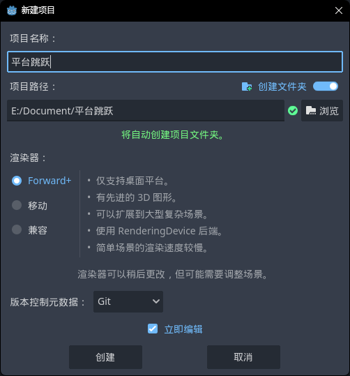
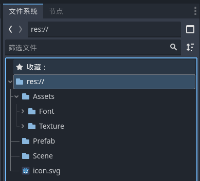
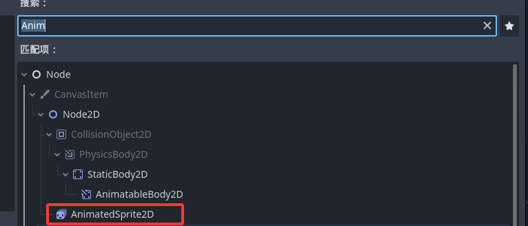
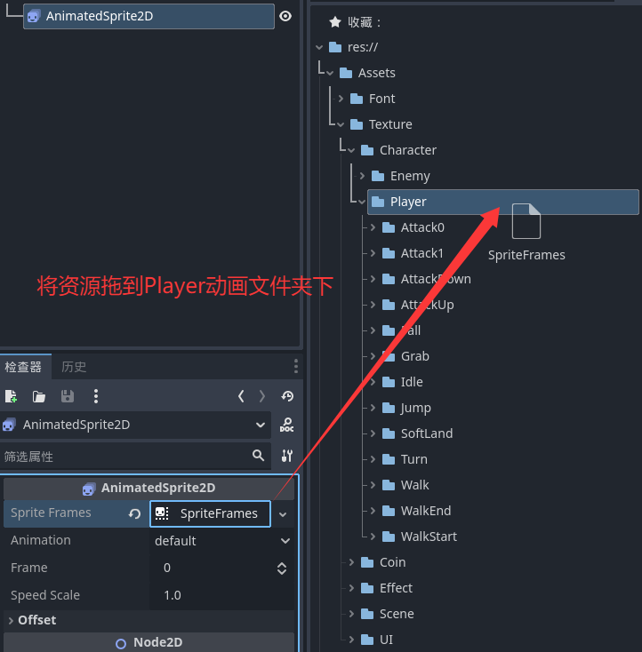
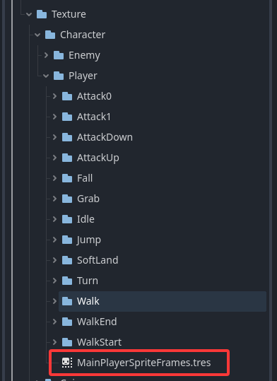
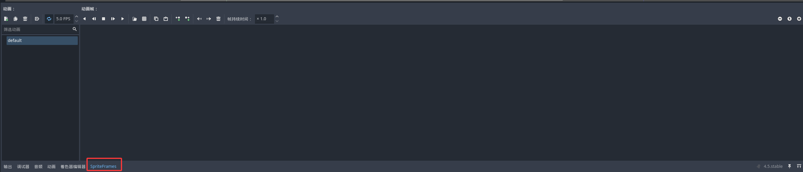
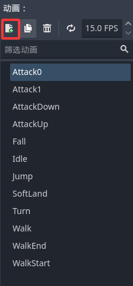
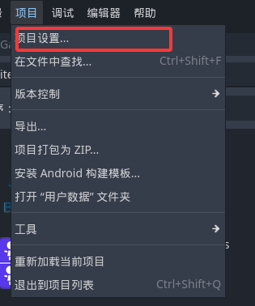
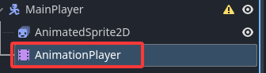
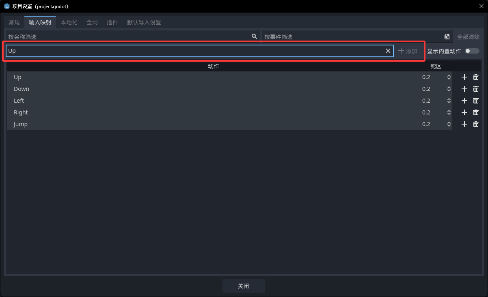

## 一. 准备

### 1. 软件

引擎的官网为 **[https://godotengine.org/]()**，十月初，现在Godot的最新版本为4.5，下载的压缩包直接解压就有运行程序，无需安装。

### 2. 新建工程

没有什么额外的改动。



### 3. 素材资源


### 4. 资源网站

**[http://itch.io]()**

**[http://opengameart.org]()**

**[kenney.nl]()**

## 二. 工程准备


### 1. 工程目录准备

其实工程目录结构结构这种事见仁见智，大家可以按照自己的喜好设置。

我是比较习惯这种布局:


### 2. 导入资源

下载的Brackeys的资源直接拖进assets中。



## 三. 开始

### 1. 创建Game主场景

创建一个2D Scene的根节点（Root Node）,重命名为GameScene，保存在Scenes中。


右上的区局为运行菜单，第一个可以运行项目（快捷键F5），第一次点击会确定主场景，之后也可以在项目设置中修改。运行后会弹出一个新的弹窗。可以使用菜单栏中的按键终止运行，或者快捷键F8，或者直接关掉窗口。


### 2. 创建Player

### Ⅰ.创建场景

**①在Prefab文件夹下新建Player文件夹**

**②新建MainPlayer场景**

**③点击按钮选择对应节点类型**

**④选择CharacterBody2D结点类型**


**给MainPlayer添加一个AnimatedSprite2D子节点** （可以点击Scene窗口中的加号，或者在Scene窗口中的CharacterBody2D上右键新建子节点【快捷键Ctrl+A】）




### Ⅱ.为AnimatedSprite2D添加动画

**①点击AnimatedSprite2D节点,检查器会出现对应节点的属性**

②点击属性Sprite Frames新建SpriteFrames资源


保存SpriteFrames为资源,方便反复使用

①将SpriteFrames资源拖动至Player动画文件夹下



②保存资源(tres后缀为godot的资源文件,godot会自动识别对应资源类型)


添加动画到SpriteFrames

①双击MainPlayerSpriteFrames.tres资源



②编辑器下方出现SpriteFrams选项卡,点击进入SpriteFrames资源编辑



③点击按钮新建动画并重命名为对应动画



④将对应动画帧拖动到对应动画中


### Ⅲ.下载动画转换插件

①点击编辑器上方资源库,进入资源商城


②下载Auto-Keyframe SpriteFrames Animations插件


③安装插件到addons文件夹


④打开项目设置



⑤点击插件选项卡,启用插件


### Ⅳ.编辑AnimationPlayer节点

①创建AnimationPlayer节点



②点击节点,或者编辑器下方动画进入动画编辑


③点击AnimationPlayer节点,会出现我们安装的插件的按钮


④添加动画到AnimationPlayer


⑤设置Idle为初始动画(点击编辑旁边的按钮加载后自动播放)

⑥设置动画循环播放(点击轨道旁的循环播放按钮)


### Ⅵ.创建碰撞盒

①.创建CollisionShape2D节点,调整节点顺序(引擎会按照节点顺序绘制图像)


②创建碰撞形状


③将形状设置成合适大小


### Ⅶ.创建角色控制脚本

①点击MainPlayer节点,点击创建脚本按钮


②勾选启用模板按钮,然后选择模板(godot自带一套基础的移动模板)


MainPlayer.gd

```MainPlayer.gd
extends CharacterBody2D


const SPEED = 300.0
const JUMP_VELOCITY = -400.0


func _physics_process(delta: float) -> void:
	# Add the gravity.
	if not is_on_floor():
		velocity += get_gravity() * delta

	# Handle jump.
	if Input.is_action_just_pressed("ui_accept") and is_on_floor():
		velocity.y = JUMP_VELOCITY

	# Get the input direction and handle the movement/deceleration.
	# As good practice, you should replace UI actions with custom gameplay actions.
	var direction := Input.get_axis("ui_left", "ui_right")
	if direction:
		velocity.x = direction * SPEED
	else:
		velocity.x = move_toward(velocity.x, 0, SPEED)

	move_and_slide()

```

### Ⅷ.设置按键映射

①进入项目设置的输入映射


②添加所需要的动作



③添加动作事件(点击加号添加对应动作的事件)


④将脚本中的按键设置为我们自己的按键

MainPlayer.gd

```MainPlayer.gd
extends CharacterBody2D


const SPEED = 300.0
const JUMP_VELOCITY = -400.0


func _physics_process(delta: float) -> void:
	# Add the gravity.
	if not is_on_floor():
		velocity += get_gravity() * delta

	# Handle jump.
	if Input.is_action_just_pressed("Jump") and is_on_floor():
		velocity.y = JUMP_VELOCITY

	# Get the input direction and handle the movement/deceleration.
	# As good practice, you should replace UI actions with custom gameplay actions.
	var direction := Input.get_axis("Left", "Right")
	if direction:
		velocity.x = direction * SPEED
	else:
		velocity.x = move_toward(velocity.x, 0, SPEED)

	move_and_slide()

```
