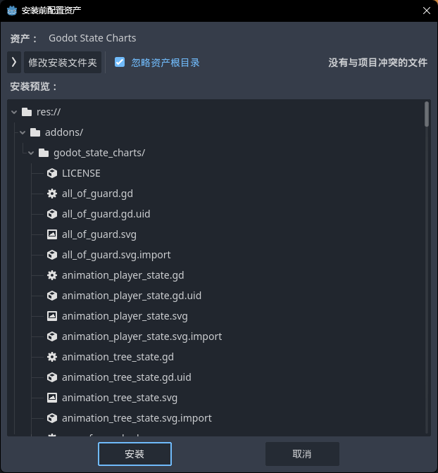
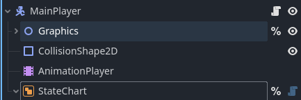
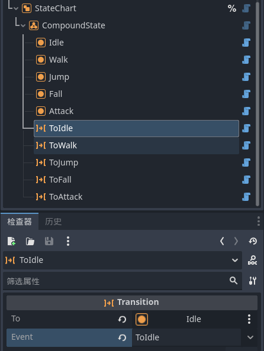
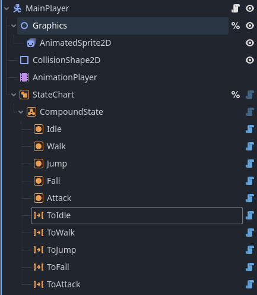

## 一. 制作Player控制器

### 1.下载状态机插件

插件说明文档:[https://derkork.github.io/godot-statecharts/usage/events-and-transitions](https://derkork.github.io/godot-statecharts/usage/events-and-transitions)

①在资产库中下载GodotStateCharts插件


②安装在adoons文件夹下方



③启用插件


### 2. 设置场景结构

①创建一个Node2D节点将AnimatedSprite2D节点放在其下方,方便控制玩家转向


②右键AnimatedSprite2D节点,勾选%作为唯一名称访问


③创建状态图节点StateChart并且,勾选%作为唯一名称访问



④创建复合状态节点CompoundState作为在StateChart


⑤点击CompoundState节点,在场景旁边会出现一个快捷创建的栏位


⑥点击创建原子态节点AtomicState并重命名为

Idle-闲置状态

Walk-行走状态

Jump-跳跃状态

Fall-下落状态

Attack-攻击状态


⑦点击创建状态转换节点Transition

设置每个Transitiond,To和Event属性为对应状态

ToIdle的To属性选择Idle,Event属性设置成ToIdle

以此类推



⑧完整场景结构



### 3项目设置

①在项目设置中的物理选项设置默认重力为2940.0

**tips:重力大可以增加跳跃手感**


### 4.编辑玩家控制脚本

#### Ⅰ.清空脚本

清空之前的控制脚本,留下继承脚本

MainPlayer.gd

```
extends CharacterBody2D
```

#### Ⅱ.常量设置

MainPlayer.gd

```
extends CharacterBody2D

const WALK_SPEED : float = 600.0#行走速度
const WALK_AIR_SPEED : float = 600.0#空中移动速度
const JUMP_SPEED_MIN : float = 800.0#跳跃最小速度
const JUMP_SPEED_MAX : float = 1200.0#跳跃最大速度
const JUMP_SPEED_INCREASE : float = 10000.0#跳跃增长速度
const FALL_SPEED_MAX : float = 500.0#下落最大速度
```

#### Ⅲ.onready标记属性

MainPlayer.gd

```
extends CharacterBody2D

const WALK_SPEED : float = 600.0#行走速度
const WALK_AIR_SPEED : float = 600.0#空中移动速度
const JUMP_SPEED_MIN : float = 800.0#跳跃最小速度
const JUMP_SPEED_MAX : float = 1200.0#跳跃最大速度
const JUMP_SPEED_INCREASE : float = 10000.0#跳跃增长速度
const FALL_SPEED_MAX : float = 500.0#下落最大速度

#标记后续属性会在 Node 就绪时赋值
@onready var animationPlayer: AnimationPlayer = %AnimationPlayer
@onready var stateChart: StateChart = %StateChart
@onready var graphics: Node2D = %Graphics
```

#### Ⅳ.创建变量

```
#X轴方向
var xAxis : float = 0
#跳跃按下
var jumpInput : bool = false
#攻击键按下
var attackInput : bool = false
#重力
var gravity : Vector2 = Vector2.ZERO
#跳跃结束
var jumpOver : bool = false
#攻击状态可切换,导出属性可以在动画编辑器添加轨道
@export var attackCanChange : bool = false
#当前攻击连击
var attackLoopIndex : int = 0
```

#### Ⅴ.创建函数

MainPlayer.gd

```
执行extends CharacterBody2D

const WALK_SPEED : float = 600.0#行走速度
const WALK_AIR_SPEED : float = 600.0#空中移动速度
const JUMP_SPEED_MIN : float = 800.0#跳跃最小速度
const JUMP_SPEED_MAX : float = 1200.0#跳跃最大速度
const JUMP_SPEED_INCREASE : float = 10000.0#跳跃增长速度
const FALL_SPEED_MAX : float = 500.0#下落最大速度

#标记后续属性会在 Node 就绪时赋值
@onready var animationPlayer: AnimationPlayer = %AnimationPlayer
@onready var stateChart: StateChart = %StateChart
@onready var graphics: Node2D = %Graphics

#X轴方向
var xAxis : float = 0
#跳跃按下
var jumpInput : bool = false
#攻击键按下
var attackInput : bool = false
#重力
var gravity : Vector2 = Vector2.ZERO
#跳跃结束
var jumpOver : bool = false

#准备脚本,当节点“就绪”时被调用，即当节点及其子节点都已经进入场景树时
func _ready() -> void:
	pass

#每个物理周期调用一次，允许节点将其逻辑与物理周期同步。delta 是物理周期之间的逻辑时间（单位为秒）
func _physics_process(delta: float) -> void:
	pass

#检测是否能跳跃
func CanJump() -> bool :
	return false

#Idle状态进入执行
func IdleEntered() -> void:
	pass

#Idle状态物理帧执行
func IdlePhysicsProcessing(delta: float) -> void:
	pass

#Idle状态退出执行
func IdleExited() -> void:
	pass

#Walk状态进入执行
func WalkEntered() -> void:
	pass

#Walk状态物理帧执行
func WalkPhysicsProcessing(delta: float) -> void:
	pass

#Walk状态退出执行
func WalkExited() -> void:
	pass

#Jump状态进入执行
func JumpEntered() -> void:
	pass

#Jump状态物理帧执行
func JumpPhysicsProcessing(delta: float) -> void:
	pass

#Jump状态退出执行
func JumpExited() -> void:
	pass

#Fall状态进入执行
func FallEntered() -> void:
	pass

#Fall状态物理帧执行
func FallPhysicsProcessing(delta: float) -> void:
	pass

#Fall状态退出执行
func FallExited() -> void:
	pass

#Attack状态进入执行
func AttackEntered() -> void:
	pass

#Attack状态物理帧执行
func AttackPhysicsProcessing(delta: float) -> void:
	pass

#Attack状态退出执行
func AttackExited() -> void:
	pass

#动画结束执行
func AnimationFinished(animName: StringName) -> void:
	pass
```

#### Ⅵ.连接信号

①.点击我们创建的原子态节点AtomicState,选择节点标签页


②双击信号将state_entered,state_physics_processing,state_exited链接到对应的函数


③连接AnimationFinished


#### Ⅶ.编写脚本

##### ①_physics_process

```
func _physics_process(delta: float) -> void:
	#获取重力
	gravity = get_gravity()

	#获取x轴
	xAxis = Input.get_axis( &"Left" , &"Right" )
	#获取按下跳跃键
	jumpInput = Input.is_action_just_pressed( "Jump" )
	#获取按下攻击键
	attackInput = Input.is_action_just_pressed( "Attack" )

	#根据 velocity 移动该物体
	move_and_slide()

	#判断是否落在地面上
	if is_on_floor() :
		jumpOver = false
```

##### ②辅助函数

```
#检测是否能跳跃
func CanJump() -> bool :
	return jumpInput
```

##### ③Idle状态

```
#Idle状态进入执行
func IdleEntered() -> void:
	animationPlayer.play( &"Idle" )

#Idle状态物理帧执行
func IdlePhysicsProcessing(delta: float) -> void:
	#检测是否在地面
	if !is_on_floor() :
		#增加y轴方向速度
		velocity.y += gravity.y * delta

	#检测x轴有输入,没输入时为0
	if xAxis != 0 :
		#跳转状态到Walk
		stateChart.send_event( "ToWalk" )
		return
	else :
		#逐渐降低速度到0
		velocity.x = move_toward( velocity.x , 0 , delta * 5000.0 )

	#当y轴速度大于0时,判定为下落状态
	if velocity.y > 0 :
		#设置跳跃结束
		jumpOver = true
		#跳转状态到Fall
		stateChart.send_event( "ToFall" )
		return

	#如果在地面
	if is_on_floor() :
		#如果可以跳跃
		if CanJump() :
			#跳转状态到Jump
			stateChart.send_event( "ToJump" )
			return

	#如果按下攻击键
	if attackInput :
		#跳转状态到Attack
		stateChart.send_event( "ToAttack" )
		return

#Idle状态退出执行
func IdleExited() -> void:
	pass
```

##### ④Walk状态

```
#Walk状态进入执行
func WalkEntered() -> void:
	#播放Walk动画
	animationPlayer.play( &"WalkStart" )
	animationPlayer.queue( &"Walk" )

#Walk状态物理帧执行
func WalkPhysicsProcessing(delta: float) -> void:
	#检测是否在地面
	if !is_on_floor() :
		velocity.y += gravity.y * delta

	#检测x轴有输入,没输入时为0
	if xAxis == 0 :
		stateChart.send_event( "ToIdle" )
		return
	else :
		velocity.x = move_toward( velocity.x , xAxis * WALK_SPEED , delta * 8000.0 )
		#检测角色朝向是否与输入相同
		if sign( graphics.scale.x ) != sign( xAxis ) :
			#检测当前动画是否为转向动画
			if animationPlayer.current_animation != &"Turn" :
				#设置转向为当前输入方向
				graphics.scale.x = -graphics.scale.x
				#播放转向动画
				animationPlayer.play( &"Turn" )
				animationPlayer.queue( &"Walk" )

	#当y轴速度大于0时,判定为下落状态
	if velocity.y > 0 :
		#设置跳跃结束
		jumpOver = true
		#跳转状态到Fall
		stateChart.send_event( "ToFall" )
		return

	#如果在地面
	if is_on_floor() :
		#如果可以跳跃
		if CanJump() :
			#跳转状态到Jump
			stateChart.send_event( "ToJump" )
			return

	#如果按下攻击键
	if attackInput :
		#跳转状态到Attack
		stateChart.send_event( "ToAttack" )
		return

#Walk状态退出执行
func WalkExited() -> void:
	#播放行走结束动画
	animationPlayer.play( &"WalkEnd" 

```

优化Idle状态进入函数,使WalkEnd动画顺利播放完成

```
#Idle状态进入执行
func IdleEntered() -> void:
	#播放Idle动画
	if animationPlayer.current_animation == &"WalkEnd" || animationPlayer.current_animation == &"SoftLand" :
		animationPlayer.queue( &"Idle" )
	else :
		animationPlayer.play( &"Idle" )
```

##### ⑤Jump状态

```
#Jump状态进入执行
func JumpEntered() -> void:
	#设置为最小跳跃速度
	velocity += up_direction * JUMP_SPEED_MIN
	#播放跳跃动画
	animationPlayer.play( &"Jump" )

#Jump状态物理帧执行
func JumpPhysicsProcessing(delta: float) -> void:
	#检测x轴有输入,没输入时为0
	if xAxis == 0 :
		velocity.x = move_toward( velocity.x , 0.0 , delta * 5000.0 )
	else :
		velocity.x = move_toward( velocity.x , xAxis * WALK_AIR_SPEED , delta * 5000.0 )
		#检测角色朝向是否与输入相同
		if sign( graphics.scale.x ) != sign( xAxis ) :
			graphics.scale.x = -graphics.scale.x

	#松开跳跃键
	if Input.is_action_just_released( "Jump" ) :
		#将y轴速度降低优化手感
		velocity.y /= 4.0
		#跳跃结束
		jumpOver = true
		return

	#检测地面
	if is_on_floor() :
		#检测x轴有输入,没输入时为0
		if xAxis == 0 :
			#没输入转为Idle状态
			stateChart.send_event( "ToIdle" )
		else :
			#有输入转为Walk状态
			stateChart.send_event( "ToWalk" )
		return
	else :
		#在跳跃结束的时候或者没有按下跳跃键的时候,将重力加入
		if jumpOver || !jumpInput :
			velocity.y += gravity.y * delta

	#当y轴速度大于0时,判定为下落状态
	if velocity.y > 0 :
		#设置跳跃结束
		jumpOver = true
		#跳转状态到Fall
		stateChart.send_event( "ToFall" )
		return

	#如果按下攻击键
	if attackInput :
		#跳转状态到Attack
		stateChart.send_event( "ToAttack" )
		return

#Jump状态退出执行
func JumpExited() -> void:
	pass
```

##### ⑥Fall状态

```
#Fall状态进入执行
func FallEntered() -> void:
	#播放Fall动画
	animationPlayer.play( &"Fall" )

#Fall状态物理帧执行
func FallPhysicsProcessing(delta: float) -> void:
	#检测x轴有输入,没输入时为0
	if xAxis == 0 :
		velocity.x = move_toward( velocity.x , 0.0 , delta * 5000.0 )
	else :
		velocity.x = move_toward( velocity.x , xAxis * WALK_AIR_SPEED , delta * 5000.0 )
		#检测角色朝向是否与输入相同
		if sign( graphics.scale.x ) != sign( xAxis ) :
			graphics.scale.x = -graphics.scale.x

	if is_on_floor() :
		#检测x轴有输入,没输入时为0
		if xAxis == 0 :
			#没输入转为Idle状态
			stateChart.send_event( "ToIdle" )
		else :
			#有输入转为Walk状态
			stateChart.send_event( "ToWalk" )
		jumpOver = false 
		return
	else :
		velocity.y += gravity.y * delta

	#如果按下攻击键
	if attackInput :
		#跳转状态到Attack
		stateChart.send_event( "ToAttack" )
		return

#Fall状态退出执行
func FallExited() -> void:
	pass
```

##### ⑦跳跃处理设计

我们希望跳跃高度根据按下跳跃键时长来控制,现在往_physics_process函数中添加部分代码

```
#每个物理周期调用一次，允许节点将其逻辑与物理周期同步。delta 是物理周期之间的逻辑时间（单位为秒）
func _physics_process(delta: float) -> void:
	#获取重力
	gravity = get_gravity()

	#获取x轴
	xAxis = Input.get_axis( &"Left" , &"Right" )
	#获取按下跳跃键
	jumpInput = Input.is_action_just_pressed( "Jump" )
	#获取按下攻击键
	attackInput = Input.is_action_just_pressed( "Attack" )

	#判断没有落在地面上
	if !is_on_floor() :
		#没有跳跃结束
		if !jumpOver :
			#跳跃键正在按下
			if Input.is_action_pressed( "Jump" ) :
				#添加速度在y轴直到最大跳跃速度
				velocity.y += up_direction.y * JUMP_SPEED_INCREASE * delta
				#到达跳跃最大速度,结束跳跃
				if velocity.y < -JUMP_SPEED_MAX :
					jumpOver = true

	#根据 velocity 移动该物体
	move_and_slide()

	#判断是否落在地面上
	if is_on_floor() :
		jumpOver = false
```

##### ⑧Attack状态

编码

```
#检测是否在地面
	if !is_on_floor() :
		velocity.y += gravity.y * delta
	
	#检测x轴有输入,没输入时为0
	if xAxis == 0 :
		velocity.x = move_toward( velocity.x , 0.0 , delta * 5000.0 )
	else :
		#攻击方向不能在正在攻击的时候发生改变
		if attackCanChange :
			if sign( graphics.scale.x ) != sign( xAxis ) :
				graphics.scale.x = -graphics.scale.x
		if is_on_floor() :
			velocity.x = move_toward( velocity.x , xAxis * WALK_SPEED , delta * 5000.0 )
		else :
			velocity.x = move_toward( velocity.x , xAxis * WALK_AIR_SPEED , delta * 5000.0 )

	#松开跳跃键
	if Input.is_action_just_released( "Jump" ) :
		#跳跃结束
		jumpOver = true
		return

	#攻击动画循环
	if attackInput :
		if attackCanChange :
			attackLoopIndex = ( attackLoopIndex + 1 ) % 2
			match attackLoopIndex :
				0 :
					animationPlayer.play( &"Attack0" )
				1 :
					animationPlayer.play( &"Attack1" )
			attackCanChange = false
			attackInput = false

	if is_on_floor() :
		if CanJump() :
			stateChart.send_event( "ToJump" )
			return

#Attack状态退出执行
func AttackExited() -> void:
	pass
```

由于攻击状态中动画结束没有明确的结束转换逻辑我们在AnimationFinished中做动画结束转换判断

```
#动画结束执行
func AnimationFinished(animName: StringName) -> void:
	match animName :
		&"Attack0" , &"Attack1" :
			if is_on_floor() :
				if xAxis == 0.0 :
					stateChart.send_event( "ToIdle" )
				else :
					stateChart.send_event( "ToWalk" )
			else :
				stateChart.send_event( "ToFall" )
```


给攻击动画添加动画轨道:


选择MainPlayer节点


选择attackCanChange属性


点击检查器属性旁边的钥匙图标可以k关键帧


在动画开头将属性设置为false,在攻击动画可以变的时候设置为true


Attack0动画同理

##### ⑨完整代码

```
extends CharacterBody2D

const WALK_SPEED : float = 600.0#行走速度
const WALK_AIR_SPEED : float = 600.0#空中移动速度
const JUMP_SPEED_MIN : float = 400.0#跳跃最小速度
const JUMP_SPEED_MAX : float = 1200.0#跳跃最大速度
const JUMP_SPEED_INCREASE : float = 10000.0#跳跃增长速度
const FALL_SPEED_MAX : float = 500.0#下落最大速度

#标记后续属性会在 Node 就绪时赋值
@onready var animationPlayer: AnimationPlayer = %AnimationPlayer
@onready var stateChart: StateChart = %StateChart
@onready var graphics: Node2D = %Graphics

#X轴方向
var xAxis : float = 0
#跳跃按下
var jumpInput : bool = false
#攻击键按下
var attackInput : bool = false
#重力
var gravity : Vector2 = Vector2.ZERO
#跳跃结束
var jumpOver : bool = false
#攻击状态可切换,导出属性可以在动画编辑器添加轨道
@export var attackCanChange : bool = false
#当前攻击连击
var attackLoopIndex : int = 0

#准备脚本,当节点“就绪”时被调用，即当节点及其子节点都已经进入场景树时
func _ready() -> void:
	pass

#每个物理周期调用一次，允许节点将其逻辑与物理周期同步。delta 是物理周期之间的逻辑时间（单位为秒）
func _physics_process(delta: float) -> void:
	#获取重力
	gravity = get_gravity()

	#获取x轴
	xAxis = Input.get_axis( &"Left" , &"Right" )
	#获取按下跳跃键
	jumpInput = Input.is_action_just_pressed( "Jump" )
	#获取按下攻击键
	attackInput = Input.is_action_just_pressed( "Attack" )

	#判断没有落在地面上
	if !is_on_floor() :
		#没有跳跃结束
		if !jumpOver :
			#跳跃键正在按下
			if Input.is_action_pressed( "Jump" ) :
				#添加速度在y轴直到最大跳跃速度
				velocity.y += up_direction.y * JUMP_SPEED_INCREASE * delta
				#到达跳跃最大速度,结束跳跃
				if velocity.y < -JUMP_SPEED_MAX :
					jumpOver = true

	#根据 velocity 移动该物体
	move_and_slide()

	#判断是否落在地面上
	if is_on_floor() :
		jumpOver = false


#检测是否能跳跃
func CanJump() -> bool :
	return jumpInput

#Idle状态进入执行
func IdleEntered() -> void:
	#播放Idle动画
	if animationPlayer.current_animation == &"WalkEnd" || animationPlayer.current_animation == &"SoftLand" :
		animationPlayer.queue( &"Idle" )
	else :
		animationPlayer.play( &"Idle" )

#Idle状态物理帧执行
func IdlePhysicsProcessing(delta: float) -> void:
	#检测是否在地面
	if !is_on_floor() :
		#增加y轴方向速度
		velocity.y += gravity.y * delta

	#检测x轴有输入,没输入时为0
	if xAxis != 0 :
		#跳转状态到Walk
		stateChart.send_event( "ToWalk" )
		return
	else :
		#逐渐降低速度到0
		velocity.x = move_toward( velocity.x , 0 , delta * 5000.0 )

	#当y轴速度大于0时,判定为下落状态
	if velocity.y > 0 :
		#设置跳跃结束
		jumpOver = true
		#跳转状态到Fall
		stateChart.send_event( "ToFall" )
		return

	#如果在地面
	if is_on_floor() :
		#如果可以跳跃
		if CanJump() :
			#跳转状态到Jump
			stateChart.send_event( "ToJump" )
			return

	#如果按下攻击键
	if attackInput :
		#跳转状态到Attack
		stateChart.send_event( "ToAttack" )
		return

#Idle状态退出执行
func IdleExited() -> void:
	pass

#Walk状态进入执行
func WalkEntered() -> void:
	#播放Walk动画
	animationPlayer.play( &"WalkStart" )
	animationPlayer.queue( &"Walk" )

#Walk状态物理帧执行
func WalkPhysicsProcessing(delta: float) -> void:
	#检测是否在地面
	if !is_on_floor() :
		velocity.y += gravity.y * delta

	#检测x轴有输入,没输入时为0
	if xAxis == 0 :
		stateChart.send_event( "ToIdle" )
		return
	else :
		velocity.x = move_toward( velocity.x , xAxis * WALK_SPEED , delta * 8000.0 )
		#检测角色朝向是否与输入相同
		if sign( graphics.scale.x ) != sign( xAxis ) :
			#检测当前动画是否为转向动画
			if animationPlayer.current_animation != &"Turn" :
				#设置转向为当前输入方向
				graphics.scale.x = -graphics.scale.x
				#播放转向动画
				animationPlayer.play( &"Turn" )
				animationPlayer.queue( &"Walk" )

	#当y轴速度大于0时,判定为下落状态
	if velocity.y > 0 :
		#设置跳跃结束
		jumpOver = true
		#跳转状态到Fall
		stateChart.send_event( "ToFall" )
		return

	#如果在地面
	if is_on_floor() :
		#如果可以跳跃
		if CanJump() :
			#跳转状态到Jump
			stateChart.send_event( "ToJump" )
			return

	#如果按下攻击键
	if attackInput :
		#跳转状态到Attack
		stateChart.send_event( "ToAttack" )
		return

#Walk状态退出执行
func WalkExited() -> void:
	#播放行走结束动画
	animationPlayer.play( &"WalkEnd" )

#Jump状态进入执行
func JumpEntered() -> void:
	#设置为最小跳跃速度
	velocity += up_direction * JUMP_SPEED_MIN
	#播放跳跃动画
	animationPlayer.play( &"Jump" )

#Jump状态物理帧执行
func JumpPhysicsProcessing(delta: float) -> void:
	#检测x轴有输入,没输入时为0
	if xAxis == 0 :
		velocity.x = move_toward( velocity.x , 0.0 , delta * 5000.0 )
	else :
		velocity.x = move_toward( velocity.x , xAxis * WALK_AIR_SPEED , delta * 5000.0 )
		#检测角色朝向是否与输入相同
		if sign( graphics.scale.x ) != sign( xAxis ) :
			graphics.scale.x = -graphics.scale.x

	#松开跳跃键
	if Input.is_action_just_released( "Jump" ) :
		#将y轴速度降低优化手感
		velocity.y /= 4.0
		#跳跃结束
		jumpOver = true
		return

	#检测地面
	if is_on_floor() :
		#检测x轴有输入,没输入时为0
		if xAxis == 0 :
			#没输入转为Idle状态
			stateChart.send_event( "ToIdle" )
		else :
			#有输入转为Walk状态
			stateChart.send_event( "ToWalk" )
		return
	else :
		#在跳跃结束的时候或者没有按下跳跃键的时候,将重力加入
		if jumpOver || !jumpInput :
			velocity.y += gravity.y * delta

	#当y轴速度大于0时,判定为下落状态
	if velocity.y > 0 :
		#设置跳跃结束
		jumpOver = true
		#跳转状态到Fall
		stateChart.send_event( "ToFall" )
		return
	
	#如果按下攻击键
	if attackInput :
		#跳转状态到Attack
		stateChart.send_event( "ToAttack" )
		return

#Jump状态退出执行
func JumpExited() -> void:
	pass

#Fall状态进入执行
func FallEntered() -> void:
	#播放Fall动画
	animationPlayer.play( &"Fall" )

#Fall状态物理帧执行
func FallPhysicsProcessing(delta: float) -> void:
	#检测x轴有输入,没输入时为0
	if xAxis == 0 :
		velocity.x = move_toward( velocity.x , 0.0 , delta * 5000.0 )
	else :
		velocity.x = move_toward( velocity.x , xAxis * WALK_AIR_SPEED , delta * 5000.0 )
		#检测角色朝向是否与输入相同
		if sign( graphics.scale.x ) != sign( xAxis ) :
			graphics.scale.x = -graphics.scale.x

	if is_on_floor() :
		#检测x轴有输入,没输入时为0
		if xAxis == 0 :
			#没输入转为Idle状态
			stateChart.send_event( "ToIdle" )
		else :
			#有输入转为Walk状态
			stateChart.send_event( "ToWalk" )
		jumpOver = false 
		return
	else :
		velocity.y += gravity.y * delta

	#如果按下攻击键
	if attackInput :
		#跳转状态到Attack
		stateChart.send_event( "ToAttack" )
		return

#Fall状态退出执行
func FallExited() -> void:
	pass

#Attack状态进入执行
func AttackEntered() -> void:
	animationPlayer.play( &"Attack0" )

#Attack状态物理帧执行
func AttackPhysicsProcessing(delta: float) -> void:
	#检测是否在地面
	if !is_on_floor() :
		velocity.y += gravity.y * delta
	
	#检测x轴有输入,没输入时为0
	if xAxis == 0 :
		velocity.x = move_toward( velocity.x , 0.0 , delta * 5000.0 )
	else :
		#攻击方向不能在正在攻击的时候发生改变
		if attackCanChange :
			if sign( graphics.scale.x ) != sign( xAxis ) :
				graphics.scale.x = -graphics.scale.x
		if is_on_floor() :
			velocity.x = move_toward( velocity.x , xAxis * WALK_SPEED , delta * 5000.0 )
		else :
			velocity.x = move_toward( velocity.x , xAxis * WALK_AIR_SPEED , delta * 5000.0 )

	#松开跳跃键
	if Input.is_action_just_released( "Jump" ) :
		#跳跃结束
		jumpOver = true
		return

	#攻击动画循环
	if attackInput :
		if attackCanChange :
			attackLoopIndex = ( attackLoopIndex + 1 ) % 2
			match attackLoopIndex :
				0 :
					animationPlayer.play( &"Attack0" )
				1 :
					animationPlayer.play( &"Attack1" )
			attackCanChange = false
			attackInput = false

	if is_on_floor() :
		if CanJump() :
			stateChart.send_event( "ToJump" )
			return

#Attack状态退出执行
func AttackExited() -> void:
	pass

#动画结束执行
func AnimationFinished(animName: StringName) -> void:
	match animName :
		&"Attack0" , &"Attack1" :
			if is_on_floor() :
				if xAxis == 0.0 :
					stateChart.send_event( "ToIdle" )
				else :
					stateChart.send_event( "ToWalk" )
			else :
				stateChart.send_event( "ToFall" )

```


##### ⑩成果视频


